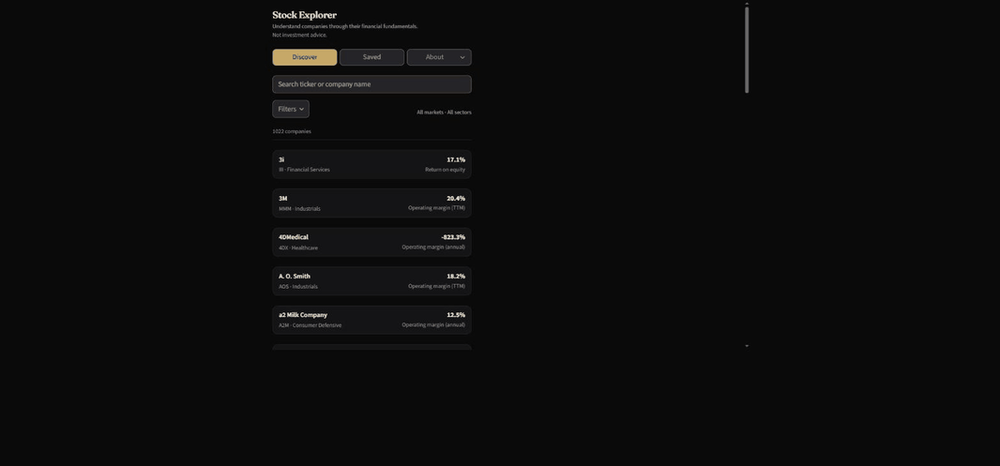
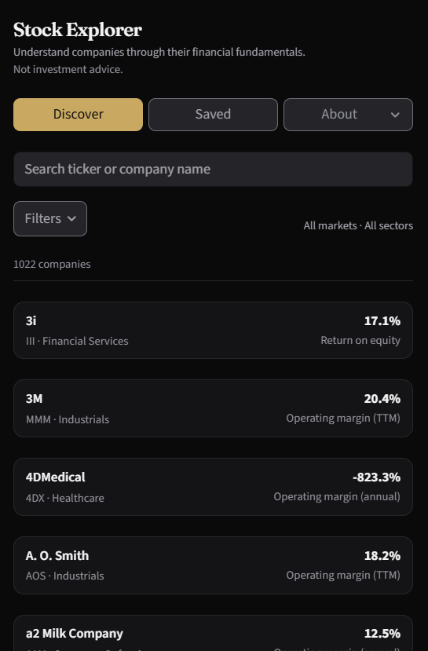
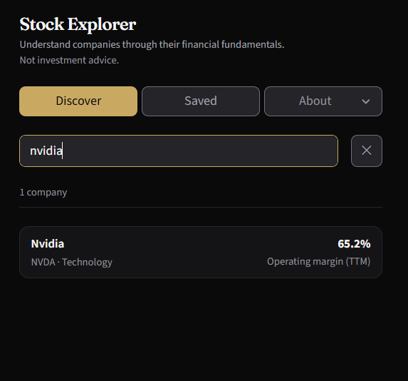
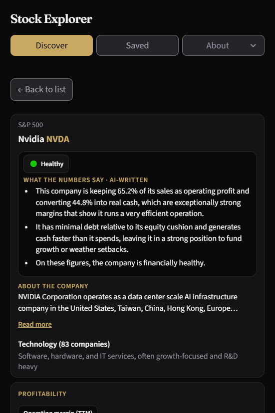
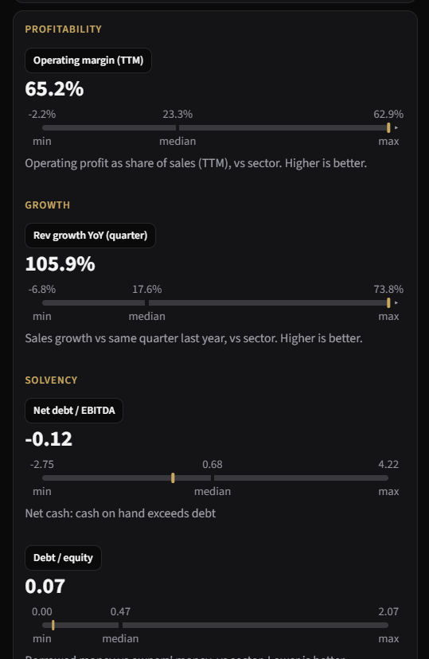
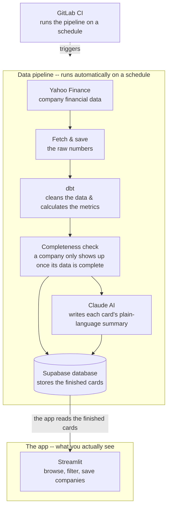

# Stock Explorer

An explore-and-learn stock app for finance-curious beginners — it turns company
fundamentals into plain-language "snapshots" you scan one at a time and save the ones worth revisiting.
Learning tool, **not** investment advice; batch fundamentals, **not** real-time trading.

**About this project:** built to explore working with AI end to end, both in development
and in one product feature.

[](https://gitlab.com/rami.al-fahham/stock-explorer-app/-/pipelines)
[](LICENSE)


**▶ Live demo (prototype):** https://stock-explorer-app.onrender.com

> Work in progress. The demo runs on Render's free tier, which **sleeps when idle** --
> a cold visit can take up to a minute to wake up. The recording below shows the
> interaction regardless.

<p align="center">
  
</p>

<p align="center">
  
  
  
  
</p>

## Getting started

### Prerequisites

| Tool | Version | Why |
|---|---|---|
| Python | 3.11 (pinned in `.python-version`) | Everything; setup refuses any other version |
| Git | 2.28 or newer; on Windows, Git for Windows (includes Git Bash) | Clone; Claude Code runs this repo's hooks in bash |
| uv | any | Optional: only the dbt MCP server in `.mcp.json` uses `uvx` |

On Windows, clone into a short folder (at most 80 characters, e.g. `C:\src\stock-explorer-app`)
or turn on long paths (`LongPathsEnabled`); the install writes paths 165 characters deep.

### Set up (no credentials)

```bash
git clone https://gitlab.com/rami.al-fahham/stock-explorer-app.git
cd stock-explorer-app
python scripts/bootstrap.py
```

Creates `.venv` and installs `requirements-dev.txt`, copies `.env` and `profiles.yml` from their
`.example` files if missing, names the GitLab remote `gitlab`, installs the pre-commit hooks and
runs `dbt deps`. A second run changes nothing: the file and remote steps skip, the installs
repeat idempotently, and no existing file is overwritten.

### Prove it works

```bash
python scripts/bootstrap.py --verify
```

Runs the tests, the pre-commit hooks on all files, sqlfluff, and a full `dbt build` on synthetic
fixtures in a temporary folder. Needs no credentials and never touches `storage/raw`.

### With credentials

Paste values into `.env` in the repo root (setup created it; it is gitignored). Nothing else
holds credentials locally.

| Variable | Where to find it | Needed for |
|---|---|---|
| `SUPABASE_URL` | Supabase: Project Settings, API | The app, export, migrations |
| `SUPABASE_ANON_KEY` | Supabase: Project Settings, API (anon / publishable key) | The app (read-only) |
| `SUPABASE_SERVICE_ROLE_KEY` | Supabase: Project Settings, API | `export_to_supabase.py` (writes production) |
| `SUPABASE_DB_PASSWORD` | Supabase: Project Settings, Database | `apply_supabase_migrations.py` |
| `ANTHROPIC_API_KEY` | Anthropic Console | Optional: `generate_assessments.py` prose reads |

With the first two set, check the connection, then run the app (use the `.venv` Python):

```bash
python scripts/check_supabase_connection.py
streamlit run streamlit_app.py
```

The service-role key and database password write production; the full checklist is
[`docs/supabase_setup.md`](docs/supabase_setup.md). To run the pipeline locally:

```bash
python scripts/run_ingestion.py --max-tickers 5   # writes storage/raw/
dbt build --project-dir dbt_analytics --profiles-dir .
python scripts/check_pipeline_completeness.py
python scripts/export_to_supabase.py
```

Markets, constituents and migrations: [`docs/operations_guide.md`](docs/operations_guide.md).

## Architecture

The durable core is a batch data pipeline; the UI is a deliberately thin, swappable
layer that reads a clean data contract out of Supabase.



Nothing runs on a developer machine in production — the pipeline is scheduled in CI and
the app reads only the exported marts.

## Highlights

- **Fundamentals as beginner snapshots** — one company at a time, plain-language gloss on
  each metric, with optional depth via progressive disclosure.
- **AI-written health reads** -- Claude Haiku turns each card's own numbers into a 2-3
  sentence plain-language read, citation-checked against the card's real figures before it
  ships; a deterministic fallback line covers the gap when a read is pending or the model
  call fails, never a blank card.
- **Per-company-type eligibility contract**: a company enters the pool only when all
  its headline fundamentals for its type are present; no fallbacks or substitute
  proxies, because incomplete data erodes trust.
- **Registry-driven markets** — the active market set lives in
  [`docs/market_registry.yml`](docs/market_registry.yml), not hard-coded.
- **Filter, then browse**: a paginated list of every match, each row showing one metric
  that's a core, verdict-deciding axis for that company type's own verdict rule
  ([`card_copy.py`](frontend/card_copy.py)'s `lead_metric_for_row`), not an arbitrary pick.
- **Automated scheduled refresh** — ingestion → dbt → export runs on schedule in GitLab
  CI (1st and 15th of each month), gated by dbt tests, a layer contract, and secret scanning.

## Design decisions

The reasoning and trade-offs behind the core — deeper context lives in
[`docs/`](docs/) and is linked, not restated.

- **Data source — yfinance, batch, not real-time.** Free and broad, with no API key, at
  the cost of being unofficial and occasionally gappy. The pipeline refreshes every two
  weeks and the app never shows a live quote; the eligibility gate absorbs missing fields rather
  than papering over them. See [`docs/project_context.md`](docs/project_context.md).
- **Transform on ephemeral DuckDB.** dbt builds against a throwaway DuckDB in CI — no
  warehouse to run or pay for, fast local iteration — then exports the finished marts to
  Supabase, which holds the only durable state. Layer rules:
  [`docs/layering.md`](docs/layering.md).
- **Eligibility as a first-class contract.** Rather than filling gaps with proxies, a
  company is simply absent until complete. Fewer, trustworthy cards over more, shaky ones.
  See [`docs/data_contract.md`](docs/data_contract.md).
- **A thin, swappable frontend.** Streamlit was chosen for fast prototype iteration, and
  the UI is intentionally decoupled — it consumes the Supabase card marts through a stable
  data contract, so it can be replaced (a different framework, another language) without
  touching the engine. The frontend is treated as the least permanent part of the system.
- **The AI read is a soft dependency, not a blocker.** `ANTHROPIC_API_KEY` is optional --
  without it the deterministic health verdict still ships, just without the prose read.
  Every generated read is checked against the card's own numbers before it's accepted; a
  `--max-reads` flag exists to cap new-call volume per run, since the read step is the
  pipeline's single biggest runtime cost otherwise.
- **No accounts in v1.** The saved list persists in a browser cookie. Zero signup
  friction and no personal data to hold, traded against no cross-device sync — deferred,
  not designed out (the `user_interactions` table is reserved for it).

## Stack

| Layer | Technology |
|---|---|
| Ingestion | Python + yfinance |
| Transform | dbt-core + dbt-duckdb (ephemeral DuckDB) |
| AI read | Claude Haiku (Anthropic API) -- per-card verdict + plain-language prose |
| Warehouse | Supabase (Postgres) |
| Frontend | Streamlit on Render (prototype -- swappable) |

## Project layout

```
stock-explorer-app/
├── CLAUDE.md                  # Entry doc for Claude Code — points to guardrails + docs
├── .claude/                   # Agent guardrails: hooks/, agents/, settings.json, working-agreement.md, review_routing.json, active_work.md, task/
├── docs/
│   ├── working_agreement.md     # UX PR gate + redirect (agent process now in .claude/)
│   ├── layering.md              # dbt layer rules
│   ├── engineering_standards.md # Naming, testing, CI
│   ├── project_context.md       # Stock-specific extensions
│   ├── market_registry.yml      # Active markets (registry-driven)
│   └── supabase_setup.md        # Supabase project + secrets checklist
├── supabase/migrations/       # SQL schema (applied via apply_supabase_migrations.py)
├── scripts/                   # Migrations, layer contract, registry sync, AI read, connection check
├── dbt_analytics/             # dbt project (1_staging → 5_marts)
├── ingestion/                 # Raw data fetch scripts
├── frontend/                  # Streamlit app (app.py)
├── streamlit_app.py           # Render's entry point (thin wrapper around frontend/app.py)
├── tests/                     # pytest, mirrors the pipeline's own layers
├── storage/                   # Gitignored: raw parquet, constituent seeds (local/CI only)
├── .gitlab-ci.yml              # CI + data pipeline
├── render.yaml                 # Render Blueprint (frontend deploy)
├── profiles.yml.example       # Copy to profiles.yml for local dbt
└── .env.example               # Copy to .env for Supabase credentials
```

## Standards (non-negotiable)

Agent process / guardrails: [`CLAUDE.md`](CLAUDE.md) -> [`.claude/working-agreement.md`](.claude/working-agreement.md); hooks and reviewer roles live in `.claude/`.

Engineering standards:

- [`docs/layering.md`](docs/layering.md) — dbt layer rules
- [`docs/engineering_standards.md`](docs/engineering_standards.md) — naming, testing, CI
- [`docs/working_agreement.md`](docs/working_agreement.md) — UX PR gate (frontend changes)

Stock-specific extensions:

- [`docs/project_context.md`](docs/project_context.md) — markets, DuckDB, ingestion, Supabase export

## Project conventions

- No business logic in ingestion — raw fields only
- All credentials via `.env` + python-dotenv
- dbt layers: `1_staging/` → `2_base/` → `3_core/` → `4_intermediate/` → `5_marts/`
- Never commit `.env` or `profiles.yml`
- Every PR must pass `ci-validate`
