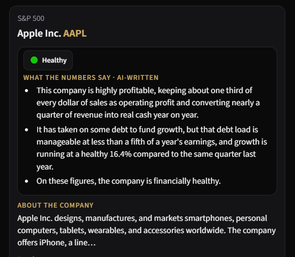
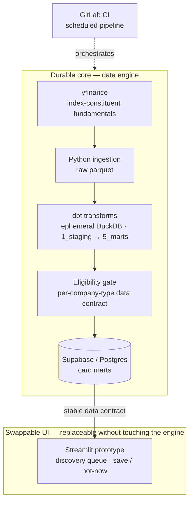

# Stock Explorer

An explore-and-learn stock app for finance-curious beginners — it turns company
fundamentals into plain-language "snapshots" you scan one at a time, save, or skip.
Learning tool, **not** investment advice; batch fundamentals, **not** real-time trading.

[](https://gitlab.com/rami.al-fahham/stock-swipe-app/-/pipelines)
[](LICENSE)


**▶ Live demo (prototype):** https://stock-explorer.streamlit.app/

> Work in progress. The demo runs on Streamlit Community Cloud's free tier, which
> **sleeps when idle** — a cold visit may show a "waking up" screen for ~30s. The
> recording below shows the interaction regardless.



<!-- optional: add docs/media/swipe-demo.gif for a short motion capture of save / not-now -->

## Architecture

The durable core is a batch data pipeline; the UI is a deliberately thin, swappable
layer that reads a clean data contract out of Supabase.



Nothing runs on a developer machine in production — the pipeline is scheduled in CI and
the app reads only the exported marts.

## Highlights

- **Fundamentals as beginner snapshots** — one company at a time, plain-language gloss on
  each metric, with optional depth via progressive disclosure.
- **Per-company-type eligibility contract**: a company enters the pool only when all
  its headline fundamentals for its type are present; no fallbacks or substitute
  proxies, because incomplete data erodes trust.
- **Registry-driven markets** — the active market set lives in
  [`docs/market_registry.yml`](docs/market_registry.yml), not hard-coded.
- **Deterministic discovery queue** — round-robin across markets, unseen-first,
  sector-balanced ([`discovery_queue.py`](frontend/discovery_queue.py)). Ordering, not
  a black-box recommender.
- **Automated scheduled refresh** — ingestion → dbt → export runs on schedule in GitLab
  CI (1st and 15th of each month), gated by dbt tests, a layer contract, and secret scanning.

## Design decisions

The reasoning and trade-offs behind the core — deeper context lives in
[`docs/`](docs/) and is linked, not restated.

- **Data source — yfinance, batch, not real-time.** Free and broad, with no API key, at
  the cost of being unofficial and occasionally gappy. The pipeline refreshes every two
  weeks and the app never shows a live quote; the eligibility gate absorbs missing fields rather
  than papering over them. See [`docs/project_context.md`](docs/project_context.md).
- **Transform on ephemeral DuckDB.** dbt builds against a throwaway DuckDB in CI — no
  warehouse to run or pay for, fast local iteration — then exports the finished marts to
  Supabase, which holds the only durable state. Layer rules:
  [`docs/layering.md`](docs/layering.md).
- **Eligibility as a first-class contract.** Rather than filling gaps with proxies, a
  company is simply absent until complete. Fewer, trustworthy cards over more, shaky ones.
  See [`docs/data_contract.md`](docs/data_contract.md).
- **A thin, swappable frontend.** Streamlit was chosen for fast prototype iteration, and
  the UI is intentionally decoupled — it consumes the Supabase card marts through a stable
  data contract, so it can be replaced (a different framework, another language) without
  touching the engine. The frontend is treated as the least permanent part of the system.
- **No accounts in v1.** Save / not-now persist in the browser's localStorage. Zero signup
  friction and no personal data to hold, traded against no cross-device sync — deferred,
  not designed out (the `user_interactions` table is reserved for it).

## Stack

| Layer | Technology |
|---|---|
| Ingestion | Python + yfinance |
| Transform | dbt-core + dbt-duckdb (ephemeral DuckDB) |
| Warehouse | Supabase (Postgres) |
| Frontend | Streamlit Community Cloud (prototype — swappable) |

## Project layout

```
stock-swipe-app/
├── CLAUDE.md                  # Entry doc for Claude Code — points to guardrails + docs
├── .claude/                   # dbt-agent-kit guardrails: working-agreement.md, review_routing.json, active_work.md, task/
├── docs/
│   ├── working_agreement.md     # UX PR gate + redirect (agent process now in .claude/)
│   ├── layering.md              # dbt layer rules
│   ├── engineering_standards.md # Naming, testing, CI
│   ├── project_context.md       # Stock-specific extensions
│   ├── market_registry.yml      # Active markets (registry-driven)
│   └── supabase_setup.md        # Supabase project + secrets checklist
├── supabase/migrations/       # SQL schema (applied via apply_supabase_migrations.py)
├── scripts/                   # Migrations, layer contract, registry sync, connection check
├── dbt_analytics/             # dbt project (1_staging → 5_marts)
├── ingestion/                 # Raw data fetch scripts
├── frontend/                  # Streamlit app (app.py)
├── .gitlab-ci.yml              # CI + data pipeline
├── profiles.yml.example       # Copy to profiles.yml for local dbt
└── .env.example               # Copy to .env for Supabase credentials
```

## Local setup

1. **Clone and create a virtual environment**

   ```bash
   python -m venv venv
   venv\Scripts\activate        # Windows
   pip install -r requirements.txt
   ```

2. **Configure dbt**

   ```bash
   copy profiles.yml.example profiles.yml
   dbt debug --project-dir dbt_analytics --profiles-dir .
   ```

3. **Configure Supabase**

   Follow [`docs/supabase_setup.md`](docs/supabase_setup.md): create a project, fill `.env`, then:

   ```bash
   copy .env.example .env
   python scripts/apply_supabase_migrations.py
   python scripts/check_supabase_connection.py
   ```

4. **Markets** — see `docs/market_registry.yml`. After edits, run `python scripts/sync_dbt_vars.py`.

5. **Refresh constituents** (optional — updates seed CSVs from Wikipedia):

   ```bash
   python scripts/refresh_constituents.py
   ```

6. **Run ingestion** (writes parquet to `storage/raw/`):

   ```bash
   python scripts/run_ingestion.py --max-tickers 5   # small local test
   python scripts/run_ingestion.py                   # all active markets
   ```

7. **Transform and export** (after ingestion):

   ```bash
   set DBT_RAW_PATH=storage/raw
   dbt build --project-dir dbt_analytics --profiles-dir .
   python scripts/check_pipeline_completeness.py
   python scripts/export_to_supabase.py
   ```

8. **Streamlit app**

   ```bash
   streamlit run streamlit_app.py
   ```

   Reads Supabase via the anon key; save / not-now persist in browser localStorage.
   No login required.

## Standards (non-negotiable)

Agent process / guardrails: [`CLAUDE.md`](CLAUDE.md) → [`.claude/working-agreement.md`](.claude/working-agreement.md) (from the [`dbt-agent-kit`](https://github.com/ramialfahham/dbt-agent-kit) plugin).

Engineering standards:

- [`docs/layering.md`](docs/layering.md) — dbt layer rules
- [`docs/engineering_standards.md`](docs/engineering_standards.md) — naming, testing, CI
- [`docs/working_agreement.md`](docs/working_agreement.md) — UX PR gate (frontend changes)

Stock-specific extensions:

- [`docs/project_context.md`](docs/project_context.md) — markets, DuckDB, ingestion, Supabase export

## Project conventions

- No business logic in ingestion — raw fields only
- All credentials via `.env` + python-dotenv
- dbt layers: `1_staging/` → `2_base/` → `3_core/` → `4_intermediate/` → `5_marts/`
- Never commit `.env` or `profiles.yml`
- Every PR must pass `ci-validate`
