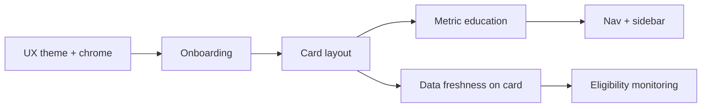

# Product roadmap — post-premortem (2026-06)

Derived from premortem analysis and [`north_star.md`](north_star.md). **Product before platform expansion.**

## Success criteria (6 months)

1. First-time user saves one company on first visit and finds it after hard refresh.
2. Weekly pipeline green; UI shows data freshness date.
3. One hero market experience feels intentional (copy + layout + sector context).
4. Less than one day per month on infra firefighting.

## Sequencing

## Work packages (GitHub issues)

| Priority | Issue | Scope |
|----------|-------|--------|
| P0 | UX theme + global styles | `styles.py`, `config.toml`, wide layout, button hierarchy |
| P0 | First-run onboarding | Welcome panel, dismiss persisted in localStorage |
| P0 | Card layout refactor | `card_ui.py`, bordered card, identity row, progress, metric grid |
| P0 | Metric education | `METRIC_LEARN`, popovers, beginner-friendly benchmark copy |
| P1 | Navigation + sidebar | Start over, Saved list, Search helper, sidebar IA |
| P1 | Data freshness on card | Show `snapshot_date` from mart on every card |
| P2 | Eligibility monitoring | CI alert / workflow summary when eligible counts drop |

## Explicitly out of scope (until success criteria met)

- New market activation beyond registry
- Auth / cross-device sync
- Phase 2 news feed
- Frontend migration off Streamlit
- Color-coded benchmark badges (north_star v1)

## Premortem guardrails

- **Do not** add markets + auth + news + full redesign in parallel.
- **Do not** ship metrics without plain-language + Learn copy.
- **Exit trigger for Streamlit:** if next major feature needs >2 weeks of Streamlit hacks, spike a real frontend.

## Verification (each UX issue)

- Manual smoke on Streamlit Cloud after merge
- Save / skip / hard refresh still works (localStorage)
- Mobile-width scan: company + 3 metrics visible without scroll
