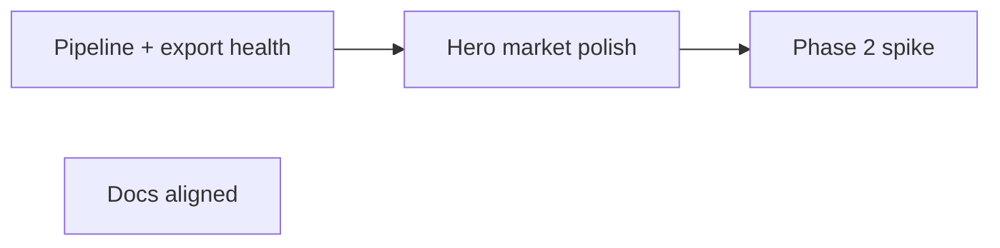

# Product roadmap — post-premortem (2026-06)

Derived from premortem analysis and [`north_star.md`](north_star.md). **Product before platform expansion.**

## Success criteria (6 months)

| # | Criterion | Status (2026-06) |
|---|-----------|------------------|
| 1 | First-time user saves one company on first visit and finds it after hard refresh | **Shipped** — localStorage Save/Skip, landing page |
| 2 | Weekly pipeline green; UI shows data freshness date | **Partial** — `snapshot_date` on card; confirm pipeline cadence in ops |
| 3 | One hero market experience feels intentional | **Not started** — next product slice |
| 4 | Less than one day per month on infra firefighting | **Ongoing** — monitor CI + Supabase migrate |

---

## Shipped (2026-06)

### UX foundation (#34–#40, UI v2)

- Streamlit theme + dark editorial card layout
- First-run landing (**Stock Explorer** branding)
- Card layout (`card_ui.py`), metric education panel
- Navigation, `snapshot_date` freshness, eligibility monitoring baseline

### Card enrichment (UI v2.2)

| Deliverable | Notes |
|-------------|--------|
| Sector glossary + headline | Plain-English sector context on every card |
| Visible metric gloss | One line under each metric value |
| Median primer + benchmark dedupe | No color coding; small-sector unavailable note |
| Company business summary | Pipeline → mart → card blurb (`business_summary`) |
| On-demand live quote | yfinance tap on footer; not in mart |
| localStorage mount fix | Single `local_storage_manager` mount per run (#56) |

---

## Sequencing — next



| Priority | Work | Scope |
|----------|------|--------|
| P0 | **Ops** | Weekly pipeline green; migration 004 applied; re-export for `business_summary`; refresh eligibility baseline after healthy run |
| P1 | **Hero market** | One market (e.g. US) with intentional copy, eligible-count transparency, queue feel |
| P2 | **Phase 2 spike** | News feed or skipped-list — only after success criteria 1–2 stable |

---

## Explicitly out of scope (until success criteria met)

- New market activation beyond registry
- Auth / cross-device sync
- Phase 2 news feed (production)
- Frontend migration off Streamlit
- Color-coded benchmark badges (north_star v1)

---

## Premortem guardrails

- **Do not** add markets + auth + news + full redesign in parallel.
- **Do not** ship metrics without plain-language + Learn copy.
- **Exit trigger for Streamlit:** if next major feature needs >2 weeks of Streamlit hacks, spike a real frontend.

---

## Verification checklist (each release)

- Manual smoke on Streamlit Cloud after merge
- Save / skip / hard refresh still works (localStorage)
- Mobile-width scan: company + 3 hero metrics visible without scroll
- Discover loads without `StreamlitDuplicateElementKey`

---

## Ops commands (reference)

```bash
# After healthy pipeline run — refresh eligibility baseline
python scripts/check_eligibility_baseline.py --duckdb-path storage/stock_data.db --write-baseline

# Re-export mart to Supabase (after dbt build)
python scripts/export_to_supabase.py
```
